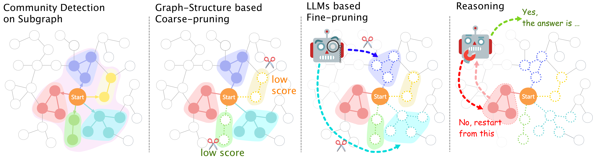

# FastToG: Wider, Deeper and Faster Think on Graph
## --_Let's think community by community!_
## Illustration of FastToG

<p style="text-align:center;">Comparison of 1-w 1-d Graph RAG (a), n-w Graph RAG (b), n-d Graph RAG (c) and n-w n-d Graph RAG (d, Ours)</p>

## A general schema of the FastToG paradigm


## How to run
1. For graph2text mode, please download: https://drive.google.com/file/d/1812Hy9eMHa_h7dQn70N6eQAmKR_x7WDH/view?usp=sharing
2. You can load the neo4j database of Wikidata from here: https://drive.google.com/file/d/1Vrdt86zqG2M1apaSAUciuqXx9BwQKd1g/view?usp=sharing
3. Given query and the subjectival entity:

```
python fasttog.py \
--query "What is the climate of the area where Pennsylvania Convention Center belong ?" \
--entity "Pennsylvania Convention Center" \
--base_path . \
--llm_api https://xxxx \
--llm_api_key xxxx \
--graph2text_path Path_of_Graph2Text_Model \
--kg_api neo4j://xxxx \
--kg_user xxxx \
--kg_pw xxxx \
--kg_graph_file_name visulize \
--community_max_size 4
```
## Arguments
* **query** question you want to ask
* **entity** subjectival entity of you question. You should check the entity exist in the KG before running the script
* **base_path** path for the files of solution
* **graph2text_path** path for your download or pretained graph2text model. If none, T2T mode will be adopted.
* **kg_graph_file_name** image name of communities visulization (generated in the base_path)

## Testcase
### Input
**query**: "What is the climate of the area where Pennsylvania Convention Center belong ?" <br />
**entity**: "Pennsylvania Convention Center" <br />

### Output
**status**: Status.OK <br />
**answer**:humid continental climate <br />

## Visualize
The visulize.png in the path 'Pennsylvania\_Convention\_Center-1725603642' for solving this query is:


## Claims
This project uses the Apache 2.0 protocol. The project assumes no legal responsibility for any of the model's output and will not be held liable for any damages that may result from the use of the resources and output.
