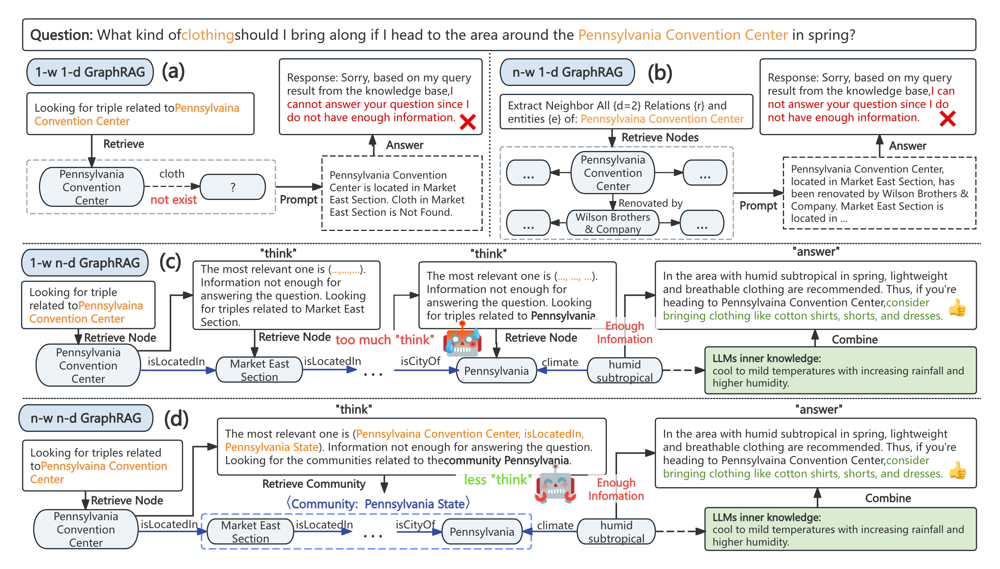
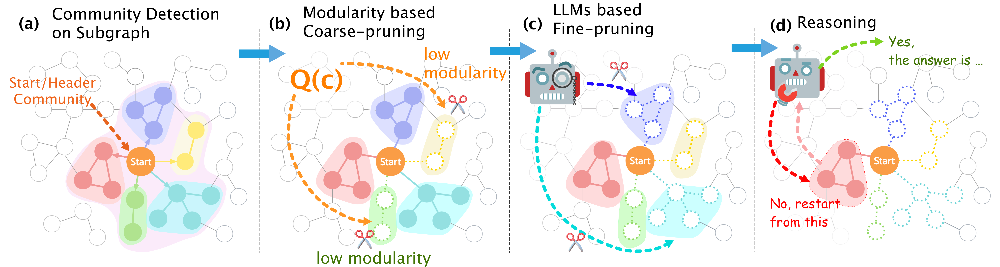
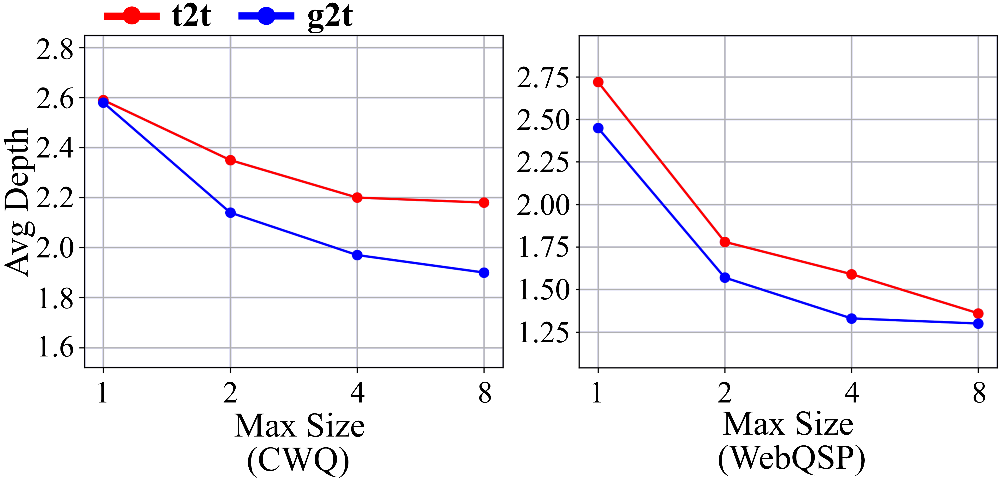
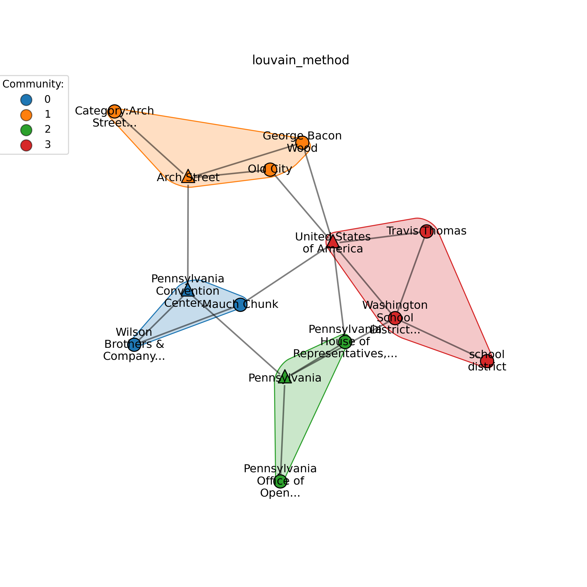

<div align="center">
    <h1>Fast Think-on-Graph: Wider, Deeper and Faster
      Reasoning of Large Language Model on Knowledge Graph</h1>
    <h2><i>💡Let's think community by community!</i></h2>
    <div>
        <a href='https://scholar.google.com/citations?user=BDYNU9MAAAAJ' target='_blank'>Xujian Liang</a><sup>1,2</sup>&emsp;
        <a href='https://scholar.google.com/citations?user=gtth-roAAAAJ' target='_blank'>Zhaoquan Gu</a><sup>2,3</sup>&emsp;
    </div>
    <div>
        <sup>1</sup>School of Cyberspace Security, Beijing University Of Posts And Telecommunications<br><sup>2</sup>Department of New Networks, Peng Cheng Laboratory<br><sup>3</sup>Harbin Institute of Technology (Shenzhen)
    </div>

</div>
<div align="center">

[](https://arxiv.org/abs/2501.14300)
[](https://github.com/dosonleung/FastToG/blob/main/FastToG_Poster.jpg)
[](https://www.apache.org/licenses/LICENSE-2.0)


</div>

## 📢News
Our paper is accepted by AAAI 2025 👏👏👏. (ORAL!!!)

## Introduction

Retrieval-Augmented Generation (RAG) enhances LLMs by integrating external knowledge, but earlier methods face limitations. Naive RAG, relying on vector similarity, struggles with low precision, recall, and explainability due to embedding ambiguities. Graph-based RAG (GRAG) improves reasoning using knowledge graphs but suffers from computational inefficiency in n-d methods and reduced recall in dense graphs for n-w approaches. To address these, Fast Think-on-Graph (FastToG) introduces a novel n-d n-w paradigm, reasoning "community by community" via local community detection and pruning. FastToG improves accuracy, speeds up reasoning, and enhances explainability by converting graph structures into text for LLMs, outperforming prior methods. FastToG exhibited the following advantages:
* **Higher Accuracy**: significant enhancement on the accuracy compared with the previous methods.
* **Faster Reasoning**: notably shorten the reasoning chains and reduce the number of calls to the LLMs.
* **Better Explainability**: The case study indicates that FastToG not only simplifies the retrieval for LLMs but also enhances the explainability for users.

## FastToG Pipline


## Experimental Result
### Performance on Accuracy
FastToG, which includes t2t and g2t mode, outperforms all previous methods. In particular, Ours(g2t) surpasses n-d 1-w (ToG) by 4.4\% in the following Table.

<div align="center">
    
|    Method  |CWQ|WebQSP|QALD|ZSRE|TREx|Creak|
|:---------------------------------:|:-----------:|:-----------:|:-------------:|:-------------:|:-------------:|:-------------:|
|I/O Prompts|31.2|49.6|38.6|26.4|46.4|90.2|
|CoT|35.1|60.8|51.8|35.6|52.0|94.6|
|CoT-SC|36.3|61.2|52.4|35.8|52.0|95.0|
|1-d 1-w|35.5|59.2|50.7|39.4|56.1|92.0|
|1-d n-w|42.3|64.4|54.8|46.1|58.8|92.8|
|n-d 1-w|42.9|63.6|54.9|54.0|64.2|95.4|
|FastToG(t2t)|43.8|65.2|56.1|54.4|67.3|95.6|
|FastToG(g2t)|45.0|65.8|55.9|54.2|68.6|96.0|

</div>

### Performance on Efficiency
With the growth of community size (see the following chart), community-based (Max Size > 1) reasoning can notably shorten the reasoning chains, reducing the number of calls to the LLMs.

<div align="center">
    
</div>

## 🏇🏻How to run
1. For graph2text mode, please download the model(T5 sft): https://drive.google.com/file/d/1812Hy9eMHa_h7dQn70N6eQAmKR_x7WDH/view?usp=sharing
2. You can load the neo4j database of Wikidata from here: https://drive.google.com/file/d/1Vrdt86zqG2M1apaSAUciuqXx9BwQKd1g/view?usp=sharing
3. Given query and the subjectival entity:

```
python fasttog.py \
--query "What is the climate of the area where Pennsylvania Convention Center belong ?" \
--entity "Pennsylvania Convention Center" \
--base_path . \
--llm_api https://xxxx \
--llm_api_key xxxx \
--graph2text_path Path_of_Graph2Text_Model \
--kg_api neo4j://xxxx \
--kg_user xxxx \
--kg_pw xxxx \
--kg_graph_file_name visulize \
--community_max_size 4
```
## 🤔Arguments
* **query** question you want to ask
* **entity** subjectival entity of you question. You should check the entity exist in the KG before running the script
* **base_path** path for the files of solution
* **graph2text_path** path for your download or pretained graph2text model. If none, T2T mode will be adopted.
* **kg_graph_file_name** image name of communities visulization (generated in the base_path)

## 🧪Testcase
### Input
**query**: "What is the climate of the area where Pennsylvania Convention Center belong ?" <br />
**entity**: "Pennsylvania Convention Center" <br />

### Output
**status**: Status.OK <br />
**answer**:humid continental climate <br />

## 😎Visualize
The visulize.png in the path 'Pennsylvania\_Convention\_Center-1725603642' for solving this query is:


## 🎩Claims
This project uses the Apache 2.0 protocol. The project assumes no legal responsibility for any of the model's output and will not be held liable for any damages that may result from the use of the resources and output.
